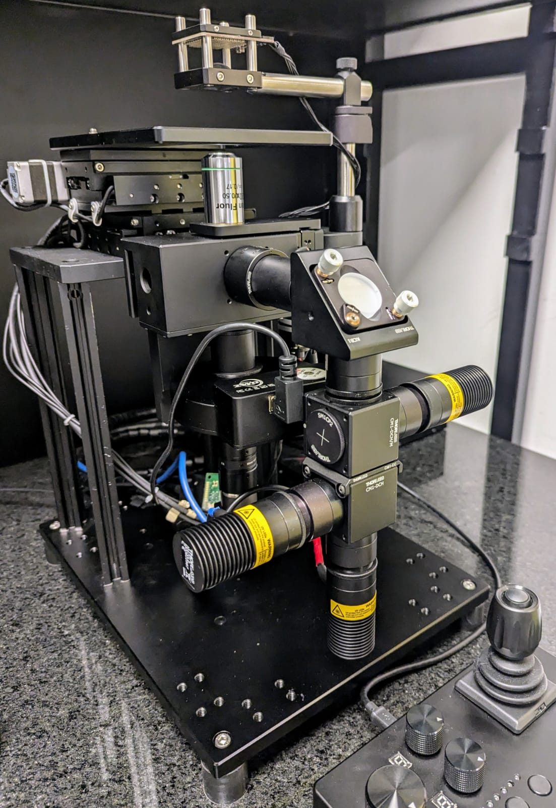

# SiMoRa - SQUID Microscope with Raman 
Our open hardware bioimaging platform for fluorescence microscopy and Raman spectroscopy based on the SQUID/OCTOPI 60x60mm inverted microscopy stage

## What is the SQUID Microscope?
Squid (Simplifying Quantitive Imaging Development and Deployment) provides a full suite of hardware and software components for rapidly configuring high-performance microscopes tailored to users' applications with reduced cost, effort and turnaround time. Besides increasing accessibility of research microscopes and available microscope hours to labs, it is also designed to simplify development and dissemination of new or otherwise advanced microscopy techniques. Applications include slide scanner for digital pathology, time lapse imaging with 2D or 3D tiling, spatial omics that involves multicolor and multi-round imaging, tracking microscopy,computational microscopy, including label free microscopy using phase/polarization/reflectance + deep learning, and super resolution microscopy.

* [1] Hongquan Li, Deepak Krishnamurthy, Ethan Li, Pranav Vyas, Nibha Akireddy, Chew Chai, Manu Prakash, "**Squid: Simplifying Quantitative Imaging Platform Development and Deployment**." BiorXiv [ link | [website](https://squid-imaging.org)]
* [2] Deepak Krishnamurthy, Hongquan Li, François Benoit du Rey, Pierre Cambournac, Adam G. Larson, Ethan Li, and Manu Prakash. "**Scale-free vertical tracking microscopy.**" Nature Methods 17, no. 10 (2020): 1040-1051. [ [link](https://www.nature.com/articles/s41592-020-0924-7) | [website](https://gravitymachine.org) ]

## SQUID resources from the creators
- main software repo: [GitHub](https://github.com/hongquanli/octopi-research) (this repo)
- tracking software repo: [GitHub](https://github.com/prakashlab/squid-tracking)
- CAD models/photos of assembled squids: [Google Drive](https://drive.google.com/drive/folders/1JdVp34HtERGpBCBlFX6jFDwMUdeBLCEx?usp=sharing)
- BOM for the microscope, including CAD files for CNC machining: [link](https://docs.google.com/spreadsheets/d/1WA64HySj9I7XROtTXuaRvjlbhHXRGspvoxb_20CWDR8/edit?usp=drivesdk)
- BOM for the multicolor laser engine: [link](https://docs.google.com/spreadsheets/d/1hEM6PsxZPTp1LY3cpxUJOS3Q1YLQN-xniF33ZddFj9U/edit#gid=1175873468)
- BOM for the control panel: [link](https://docs.google.com/spreadsheets/d/1z2HjibIG9PHffiDsbuzQXmvf2gSFMduHrXkPwDbcXRY/edit?usp=sharing)
- Eearly Results, Related Work and Possible Applications www.squid-imaging.org
- Forum to discuss instructions: https://forum.squid-imaging.org
- Spin-off company: https://cephla.com/product/squid/

# Our custom implementation

Is based on the SQUID/OCTOPI 60x60mm inverted stage.

## Optical filters used
| Filter | Type | supplier |
| :---   | :---  | :--- |
| FF458-Di02-25x36     | Beamsplitter 458 to couple in 405nm LED | [AHF](https://ahf.de/en/products/spectral-analysis-photonic/optical-filters/beamsplitters/epi-fluorescence-beamsplitters/standard-applications/longpass/beamsplitter-hc-458/F38-458)    |
| FF520-Di02-25x36   | Beamsplitter 520 to couple in 470nm LED with 635nm LED  | [AHF](https://ahf.de/en/products/spectral-analysis-photonic/optical-filters/beamsplitters/epi-fluorescence-beamsplitters/standard-applications/longpass/beamsplitter-hc-520/F38-520)    |
| ZT405/488/561/640rpcv2-UF3 | 4-band fluorescence beamsplitter       | [Chroma](https://www.chroma.com/products/parts/zt405-488-561-640rpcv2)    |
| FF01-446/523/600/677-25   | 4-band blocking filter for all fluorescence channels    | [Laser2000](https://photonics.laser2000.co.uk/products/light-delivery-and-control/microscopy-filters/filter-sets-cubes/full-multiband-sets/brightline-full-multiband-laser-filter-set-405-488-561-635-nm-laser-sources/)  |
| ZET405/488/561/640xv2 | 4-band illumination filter (20mm) | [Chroma](https://www.chroma.com/products/parts/zet405-488-561-640xv2) |
| ZT775sp-2p-UF3     | Beamsplitter brightfield to add on 785nm Raman   | [Chroma](https://www.chroma.com/products/parts/zt775sp-2p-multiphoton-shortpass-laser-dichroic)    |
| F46-950 (RT785rdc + RET785/6x + RET792LP)    | 785 nm Raman Filterset with Beamsplitter, Bandpass and Emitter      | [AHF](https://ahf.de/en/products/spectral-analysis-photonic/optical-filters/by-application/raman/raman-filter-sets/785-nm-raman-et-lp-filter-set/F46-950)    |

Inspired by the [Benchtop mesoSPIM light sheet microscope](https://github.com/mesoSPIM/benchtop-hardware/tree/main), we have incorporated the [ZWO-asto mini electronic filter wheel (EFW)](https://www.zwoastro.com/product/efw/) with the following filter selections:
| Position | Filter | Type | supplier |
| :---   | :---   | :---  | :--- |
|#1 - All| none     | The four bands of the multiband blockig filter are visible simultaneously |     |
|#2 - Blue| 447/60 BrightLine HC     | Filter blue, e.g. DAPI stain | [AHF](https://www.ahf.de/produkte/spektralanalytik-photonik/optische-filter/einzelfilter/bandpass-filter/400-499-nm/1671/447/60-brightline-hc)    |
|#3 - Green| 525/39 BrightLine HC     | Filter green, e.g. sfGFP | [AHF](https://ahf.de/produkte/spektralanalytik-photonik/optische-filter/einzelfilter/bandpass-filter/500-599-nm/525-39-brightline-hc/F37-527)    |
|#4 - Orange| 600/37 BrightLine HC     | Filter organge | [AHF](https://ahf.de/produkte/spektralanalytik-photonik/optische-filter/einzelfilter/bandpass-filter/600-699-nm/600-37-brightline-hc/F39-637)    |
|#5 - Red| 635 LP Langpass-Filter     | Filter red , e.g. PI stain | [AHF](https://ahf.de/produkte/spektralanalytik-photonik/optische-filter/einzelfilter/langpass-filter/600-699-nm/635-lp-edge-basic-langpass-filter/F76-635)    |

Bill of materials for the Raman add-on:

Laser-engine:
* 785nm fiber laser ([Thorlabs, LP785-SAV50](https://www.thorlabs.com/newgrouppage9.cfm?objectgroup_id=7783&pn=LP785-SAV50#7784))
* ESD Protection and Strain Relief Cable ([Thorlabs, SR9A](https://www.thorlabs.com/newgrouppage9.cfm?objectgroup_id=2710&pn=SR9A))
* 4x M2 hex-head screws (6-9.5mm long)
* Custom two-piece aluminium laser "clamshell" for thorlabs pig-tailed laser-diodes, similar to [this Thorlabs mount LDM9LP](https://www.thorlabs.com/newgrouppage9.cfm?objectgroup_id=4839)
* Custom aluminium mounting plate with screw holes
* 4x M2.5 (5.5-8mm) countersink screws to attach the laser "clamshell" to to the laser mouting plate
* 4x M2.5 (5.5mm) hex-head screws to attach the laser mouting plate to the cooler cross bars
* Teensy 4.1 microcontroller with pins soldered
* CPU cooler fan (DYNATRON-corp.com, U10)
* Custom main single channel laser-engine board (here V1.1)) with Teensy-mount at front, cooled TCM1040/1041 mount, and tec-driver break-out at back (Yexian, 1041 V0.4.1)
* Laser-driver board [FL591FL Evaluation PCB & FL500 Laser Diode Driver](https://www.teamwavelength.com/product/fl591fl-evaluation-pcb-fl500-laser-diode-driver/?srsltid=AfmBOoozVTAnHhwxmi-iK4C9aj5j4m46LKKndWX-x-GoR4wqOxvL3puJ)

Questions:
* What peltier element? (size, voltage, position, connector?)
* laser "clamshell" screw holes don't fit onto the laser mounting plate - where to mount?
* Software for laser engine
* Connectors for laser engine
* Where to connect 12V PSU to laser engine
* Where to mount laser driver on laser engine?
* How/where to mount "DC 12v 3a 4pin PMW PC CPU fan temperature controll thermostat speed controller" (ZHIYU, ZF1X4L) and how many of the three units do I use?
  
needed:
* 2x imperial 2-56 screws (ca. 5mm) to fix the laser head to the laser "clamshell"

Follow us! [#twitter](https://twitter.com/WenzelLab), [#YouTube](https://www.youtube.com/@librehub), [#LinkedIn](https://www.linkedin.com/company/92802424), [#instagram](https://www.instagram.com/wenzellab/), [#Printables](https://www.printables.com/@WenzelLab), [#LIBREhub website](https://librehub.github.io), [#IIBM website](https://ingenieriabiologicaymedica.uc.cl/en/people/faculty/821-tobias-wenzel)
