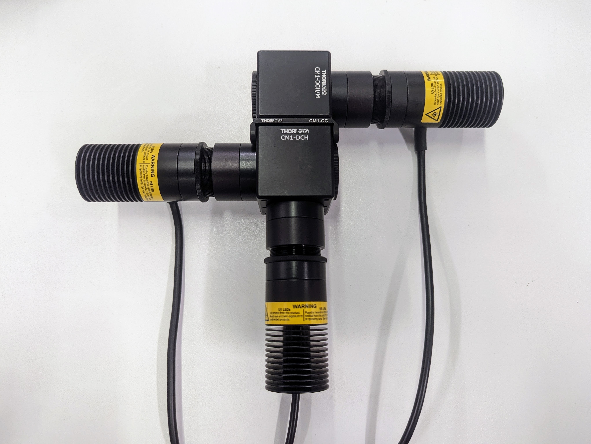
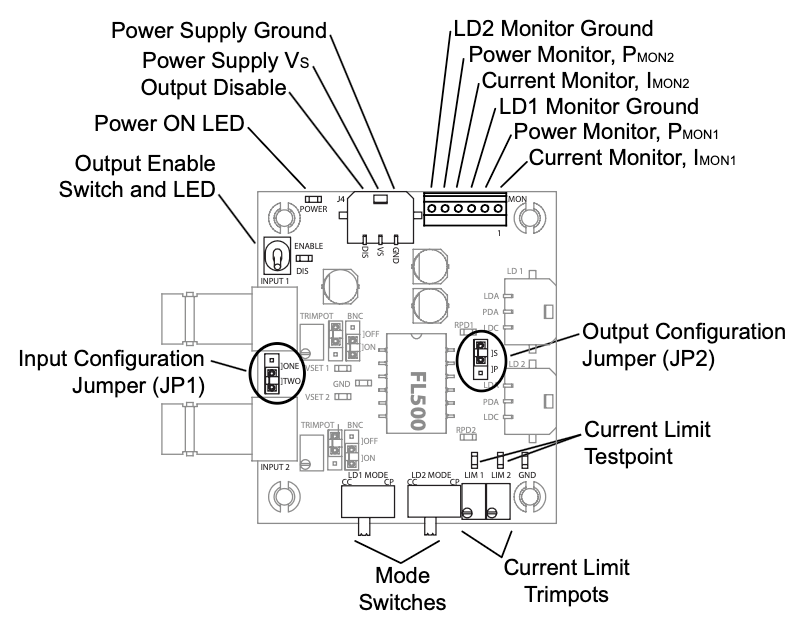
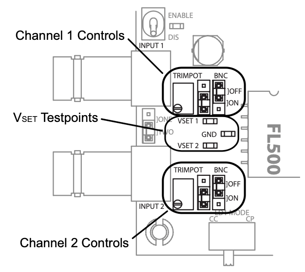
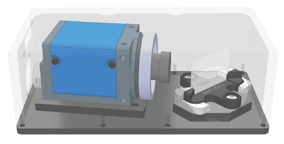

# SiMoRa - SQUID Microscope with Raman 
Our open hardware bioimaging platform for fluorescence microscopy and Raman spectroscopy based on the SQUID/OCTOPI 60x60mm inverted microscopy stage and a temperature and gas-controll enclosure.

## What is the SQUID Microscope?
Squid (Simplifying Quantitive Imaging Development and Deployment) provides a full suite of hardware and software components for rapidly configuring high-performance microscopes tailored to users' applications with reduced cost, effort and turnaround time. Besides increasing accessibility of research microscopes and available microscope hours to labs, it is also designed to simplify development and dissemination of new or otherwise advanced microscopy techniques. Applications include slide scanner for digital pathology, time lapse imaging with 2D or 3D tiling, spatial omics that involves multicolor and multi-round imaging, tracking microscopy,computational microscopy, including label free microscopy using phase/polarization/reflectance + deep learning, and super resolution microscopy.

* [1] Hongquan Li, Deepak Krishnamurthy, Ethan Li, Pranav Vyas, Nibha Akireddy, Chew Chai, Manu Prakash, "**Squid: Simplifying Quantitative Imaging Platform Development and Deployment**." BiorXiv [ link | [website](https://squid-imaging.org)]
* [2] Deepak Krishnamurthy, Hongquan Li, François Benoit du Rey, Pierre Cambournac, Adam G. Larson, Ethan Li, and Manu Prakash. "**Scale-free vertical tracking microscopy.**" Nature Methods 17, no. 10 (2020): 1040-1051. [ [link](https://www.nature.com/articles/s41592-020-0924-7) | [website](https://gravitymachine.org) ]

## SQUID resources from the creators (which only partially correspond to this newer version)
- main software repo: [GitHub](https://github.com/hongquanli/octopi-research) (this repo)
- tracking software repo: [GitHub](https://github.com/prakashlab/squid-tracking)
- CAD models/photos of assembled squids: [Google Drive](https://drive.google.com/drive/folders/1JdVp34HtERGpBCBlFX6jFDwMUdeBLCEx?usp=sharing)
- BOM for the microscope, including CAD files for CNC machining: [link](https://docs.google.com/spreadsheets/d/1WA64HySj9I7XROtTXuaRvjlbhHXRGspvoxb_20CWDR8/edit?usp=drivesdk)
- BOM for the multicolor laser engine: [link](https://docs.google.com/spreadsheets/d/1hEM6PsxZPTp1LY3cpxUJOS3Q1YLQN-xniF33ZddFj9U/edit#gid=1175873468)
- BOM for the control panel: [link](https://docs.google.com/spreadsheets/d/1z2HjibIG9PHffiDsbuzQXmvf2gSFMduHrXkPwDbcXRY/edit?usp=sharing)
- Eearly Results, Related Work and Possible Applications www.squid-imaging.org
- Forum to discuss instructions: https://forum.squid-imaging.org
- Spin-off company: https://cephla.com/product/squid/

# Our custom implementation

Is based on the SQUID/OCTOPI 60x60mm inverted stage.

The CO2 incubator enclosure "IncuTEC" is documented in a [seperate repository](https://github.com/wenzel-lab/IncuTEC).

## Optical filters used
| Filter | Type | supplier |
| :---   | :---  | :--- |
| FF458-Di02-25x36     | Beamsplitter 458 to couple in 405nm LED | [AHF](https://ahf.de/en/products/spectral-analysis-photonic/optical-filters/beamsplitters/epi-fluorescence-beamsplitters/standard-applications/longpass/beamsplitter-hc-458/F38-458)    |
| FF520-Di02-25x36   | Beamsplitter 520 to couple in 470nm LED with 635nm LED  | [AHF](https://ahf.de/en/products/spectral-analysis-photonic/optical-filters/beamsplitters/epi-fluorescence-beamsplitters/standard-applications/longpass/beamsplitter-hc-520/F38-520)    |
| ZT405/488/561/640rpcv2-UF3 | 4-band fluorescence beamsplitter       | [Chroma](https://www.chroma.com/products/parts/zt405-488-561-640rpcv2)    |
| FF01-446/523/600/677-25   | 4-band blocking filter for all fluorescence channels    | [Laser2000](https://photonics.laser2000.co.uk/products/light-delivery-and-control/microscopy-filters/filter-sets-cubes/full-multiband-sets/brightline-full-multiband-laser-filter-set-405-488-561-635-nm-laser-sources/)  |
| ZET405/488/561/640xv2 | 4-band illumination filter (20mm) | [Chroma](https://www.chroma.com/products/parts/zet405-488-561-640xv2) |
| ZT775sp-2p-UF3     | Beamsplitter brightfield to add on 785nm Raman   | [Chroma](https://www.chroma.com/products/parts/zt775sp-2p-multiphoton-shortpass-laser-dichroic)    |
| F46-950 (RT785rdc + RET785/6x + RET792LP)    | 785 nm Raman Filterset with Beamsplitter, Bandpass and Emitter      | [AHF](https://ahf.de/en/products/spectral-analysis-photonic/optical-filters/by-application/raman/raman-filter-sets/785-nm-raman-et-lp-filter-set/F46-950)    |

Inspired by the [Benchtop mesoSPIM light sheet microscope](https://github.com/mesoSPIM/benchtop-hardware/tree/main), we have incorporated the [ZWO-asto mini electronic filter wheel (EFW)](https://www.zwoastro.com/product/efw/) with the following filter selections:
| Position | Filter | Type | supplier |
| :---   | :---   | :---  | :--- |
|#1 - All| none     | The four bands of the multiband blockig filter are visible simultaneously |     |
|#2 - Blue| 447/60 BrightLine HC     | Filter blue, e.g. DAPI stain | [AHF](https://www.ahf.de/produkte/spektralanalytik-photonik/optische-filter/einzelfilter/bandpass-filter/400-499-nm/1671/447/60-brightline-hc)    |
|#3 - Green| 525/39 BrightLine HC     | Filter green, e.g. sfGFP | [AHF](https://ahf.de/produkte/spektralanalytik-photonik/optische-filter/einzelfilter/bandpass-filter/500-599-nm/525-39-brightline-hc/F37-527)    |
|#4 - Orange| 600/37 BrightLine HC     | Filter organge | [AHF](https://ahf.de/produkte/spektralanalytik-photonik/optische-filter/einzelfilter/bandpass-filter/600-699-nm/600-37-brightline-hc/F39-637)    |
|#5 - Red| 635 LP Langpass-Filter     | Filter red , e.g. PI stain | [AHF](https://ahf.de/produkte/spektralanalytik-photonik/optische-filter/einzelfilter/langpass-filter/600-699-nm/635-lp-edge-basic-langpass-filter/F76-635)    |

## Information on the Raman add-on:

### Laser-engine with fan-cooling (but no TEC cooler):
* Cusom anodised aluminium metal base and frame for the assembly (CEPHLA)
* 785nm fiber laser ([Thorlabs, LP785-SAV50](https://www.thorlabs.com/newgrouppage9.cfm?objectgroup_id=7783&pn=LP785-SAV50#7784))
* ESD Protection and Strain Relief Cable ([Thorlabs, SR9A](https://www.thorlabs.com/newgrouppage9.cfm?objectgroup_id=2710&pn=SR9A))
* Custom two-piece aluminium laser "clamshell" for thorlabs pig-tailed laser-diodes, similar to [this Thorlabs mount LDM9LP](https://www.thorlabs.com/newgrouppage9.cfm?objectgroup_id=4839) (CEPHLA) - note: I had to manually file the sides of the cable mount to increase the size (at 14.5+ mm) for the strain rrelief cable to pass.
* Custom thin aluminium mounting plate with screw holes (CEPHLA) - note: I manually added 4 through-holes >2.5mm, 20mm and 25mm apppart respectively, to mount the clamshell
* 4x M2 hex-head screws (6-9.5mm long)
* 4x M2.5 (5.5-8mm) countersink screws to attach the laser "clamshell" to to the laser mouting plate
* 4x M2.5 (5.5mm) hex-head screws to attach the laser mouting plate to the cooler cross bars
* Laser-driver board ([Wavelength electronics, FL591FL](https://www.teamwavelength.com/product/fl591fl-evaluation-pcb-fl500-laser-diode-driver/?srsltid=AfmBOoozVTAnHhwxmi-iK4C9aj5j4m46LKKndWX-x-GoR4wqOxvL3puJ)) with a mounted FL500 Laser Diode Driver (lot 2435318)
* 5V Power supply for the laser driver (wired soldered directly, and with switch)
* CPU cooler fan (DYNATRON-corp.com, U10)
* Small fan controller board with temperature sensor "DC 12v 3a 4pin PMW PC CPU fan temperature controll thermostat speed controller" (ZHIYU, ZF1X4L)
* 12V Power supply for the fan controll
* Custom mount for laser driver board and fan controller board

### Configuration of the laser driver FL591FL:

* We only use a single output channel (LD1 output), so only that cable and the power input cable are required, and the jumper between the (unused) BNC input ports should be set to *ONE*
* Given that the laser diode (Type E) has an unused pin, only the current controlled *CC* mode (not power-controlled) of the driver board can be used, the LD1 mode switch should be set to the left accordingly
* The jumpers next to each BNC input should be set to Trimpot *ON* (left bottom) and BNC *OFF* (right up), to output reference signals only on the trimpot
* The Output configuration jumper should be set to single *]S* (up) to enable the full output power range up to 500uA on the LD1 channel output
* It is not neccessary to assemble a test diode, since the driver power does not exceed the laser diode power, and simple multimeter measurement is enough to configure the potentiometers (current limit trimpots)

### Spectrometer:

* NIR-sensitive Camera (IDS, U3-38C0XCP-M-NO) (serial nr. 4108725980)
* camera moutable NIR lens
* 4x M3 (6mm) hex-head screws to attach the camera
* Transmission grating ([LightSmyth, T-1500-875-2516-94](https://www.maxlevy.com/category/TransGrat.html))
* Custom aluminium spectrometer casing in tro parts (base and enclosure) (CEPHLA)

### Cubes, filters and laser-coupling:
* Laser-coupler (Thorlabs, PAF2A-18B)
* Custom aluminium tripple-filter holder (CEPHLA) incl. z-stage motor with objective mount
* 8x M2 (4mm) countersunk-head screws to close spectrometer lid
* 3x filter-clamps (Thorlabs, FFM1)

Questions:
* Where does the spectrometer lens come from (part number, supplier)?
  
needed:
* 2x imperial 2-56 screws (ca. 5mm) to fix the laser head to the laser "clamshell"

not used:
* (was meant as laser and TEC driver for a higher-power laser driver): Custom main single channel laser-engine board (here V1.1)) with Teensy-mount at front, cooled TCM1040/1041 mount, and tec-driver break-out at back (Yexian, 1041 V0.4.1) (CEPHLA)

Follow us! [#twitter](https://twitter.com/WenzelLab), [#YouTube](https://www.youtube.com/@librehub), [#LinkedIn](https://www.linkedin.com/company/92802424), [#instagram](https://www.instagram.com/wenzellab/), [#Printables](https://www.printables.com/@WenzelLab), [#LIBREhub website](https://librehub.github.io), [#IIBM website](https://ingenieriabiologicaymedica.uc.cl/en/people/faculty/821-tobias-wenzel)
